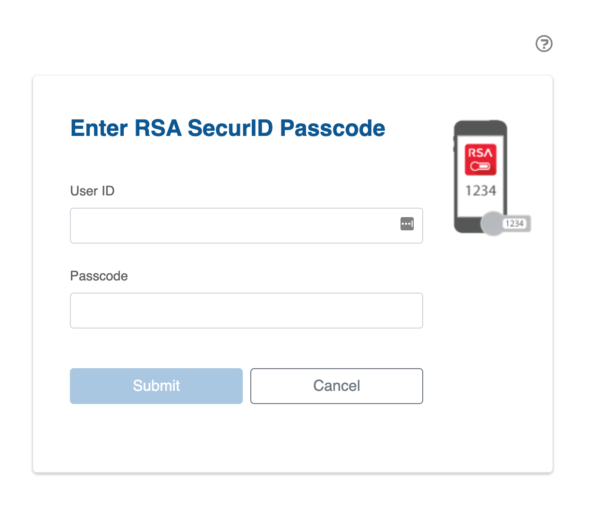
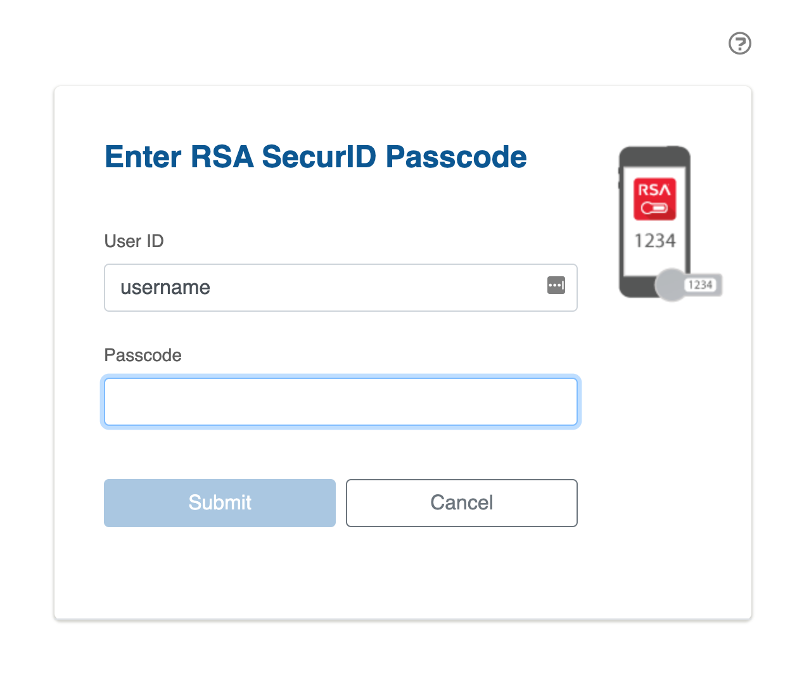

# Problem

Securid does not remember User ID by default. This is very annoying, especially on private computer.

# Solution

Securid Login Helper [user-script](https://en.wikipedia.org/wiki/Userscript).
It prepopulates username and focus input on OTP field.

# Install

https://openuserjs.org/scripts/a-b/Securid_Login_Helper
